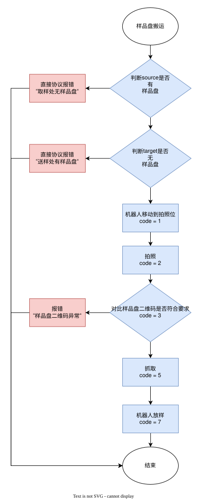
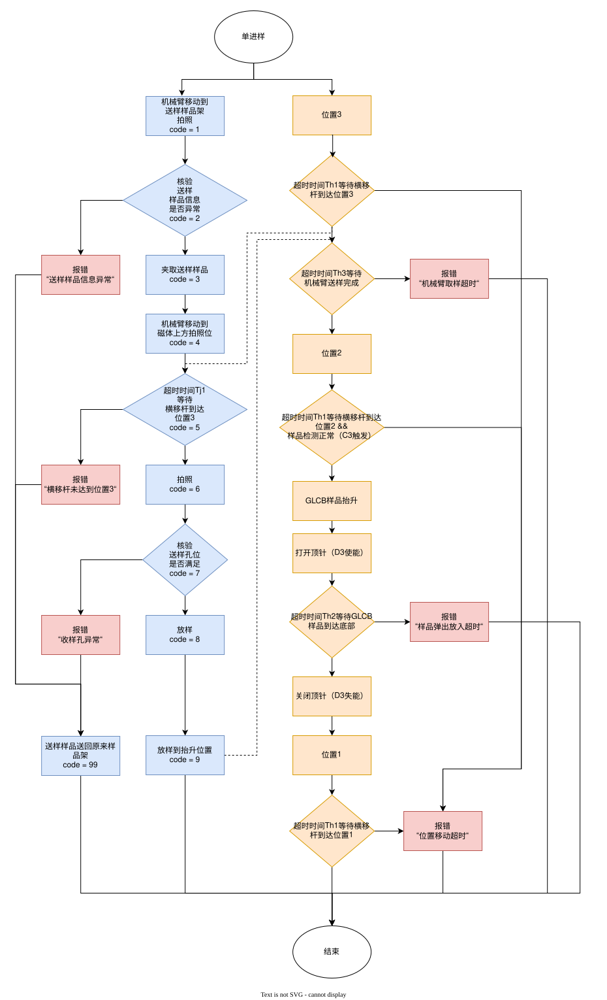
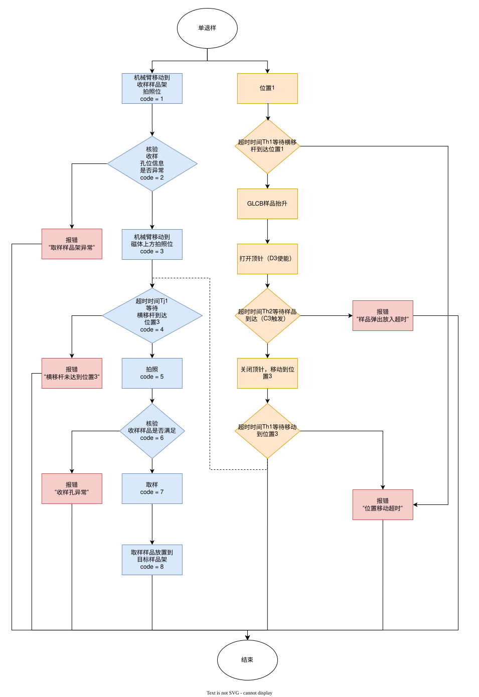
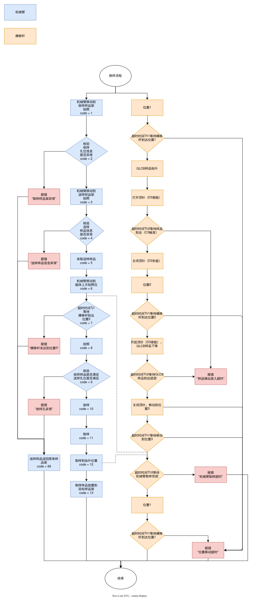

# NMR 自动化送样系统 TCP JSON 通信协议说明书


| 项目   | 内容                            |
| ---- | ----------------------------- |
| 适用范围 | NMR 自动化送样系统设备与上位机通信           |
| 通信模式 | 设备端 TCP Server；上位机 TCP Client |
| 数据格式 | JSON；UTF-8；                   |
| 文档版本 | V0.1                          |

# 1. 通信连接与消息帧

| 项目     | 定义                                     |
| ------ | -------------------------------------- |
| TCP 角色 | 设备端为 TCP Server；上位机为 TCP Client。       |
| 默认端口   | 5001                                   |
| 编码     | UTF-8。                                 |
| 消息边界   | 每条 JSON 消息后追加 LF 换行符 `\r\n`。接收端按换行符拆包。 |
| 超时     | !!!#ffcc99 上位机响应等待时间可配置，默认 5 秒；动作完成按动作类型设置独立超时。!!! |
| 重试     | 命令可重试 3 次；                             |

# 2. 通用报文格式

## 2.1 请求报文

| 字段         | 类型     | 必填  | 说明                               |
| ---------- | ------ | --- | -------------------------------- |
| msg_type   | string | 是   | 固定为 `command`。                   |
| cmd        | string | 是   | 命令名称。                            |
| request_id | string | 是   | 请求唯一编号，同一连接内不得重复；动作类命令用于追溯和幂等判断。 |
| params     | object | 是   | 命令参数对象；无参数时传 `{}`                |

```json
{
  "msg_type": "command",
  "cmd": "get_device_status",
  "request_id": "REQ202606030001",
  "params": {}
}
```

## 2.2 响应报文

响应处理结果统一通过 `code` 判断。所有响应报文中的 `code` 均取自第 12 章错误码定义：`code=0` 表示成功或已接收，`code` 非 0 表示拒绝、失败或异常。

| 字段         | 类型     | 必填  | 说明                                      |
| ---------- | ------ | --- | --------------------------------------- |
| msg_type   | string | 是   | 固定为 `response`。                         |
| cmd        | string | 是   | 对应请求命令。                                 |
| request_id | string | 是   | 必须与请求一致。                                |
| code       | int    | 是   | 响应码，取自第 12 章错误码定义；0 表示成功或已接收。           |
| message    | string | 是   | 错误或状态说明；code 非 0 时应与错误码中文说明一致，也可补充现场信息。 |
| data       | object | 是   | 响应数据对象。                                 |

```json
{
  "msg_type": "response",
  "cmd": "get_device_status",
  "request_id": "REQ202606030001",
  "code": 0,
  "message": "OK",
  "data": {
    "device_status": "idle"
  }
}
```

# 3. 命令清单

| 命令                       | 中文名称     | 用途                                                                           |
| ------------------------ | -------- | ---------------------------------------------------------------------------- |
| heartbeat                | 心跳       | 查询设备连接状态和设备信息。                                                               |
| get_device_status        | 设备状态查询   | !!!#ffcc99 按 UN/CM/EM/all 查询设备总体状态、一个或多个流程状态或设备状态反馈。!!!                              |
| set_device_mode          | 设备模式     | 设置设备运行模式。                                                                    |
| device_command           | 设备命令     | !!!#ffcc99 下发整机级启动、暂停、停止、复位命令。!!!                                                  |
| get_area_sample_status   | 区域样品状态查询 | 检查中转区、测试平台样品区域、磁体上方测试区的样品是否为空。                                               |
| scan_qrcode              | 二维码识别    | 对指定区域拍照并识别二维码；transfer/platform 返回样品盘二维码和 10 个样品位二维码，test_area 只返回 1 个样品二维码。 |
| move_plate               | 样品盘搬运    | 根据源区域和目的区域搬运样品盘/样品台。                                                         |
| move_sample              | 样品搬运（单进样/单退样） | !!!#ffcc99 根据源区域/孔位和目的区域/孔位执行单进样或单退样。!!!                                  |
| move_sample_in_out       | 样品进退样    | !!!#ffcc99 在同一条命令中同时指定进样和退样任务。!!!                                                |
| get_crossbar_status      | 横移杆状态    | 读取横移杆位置、阀输出和传感器输入。                                                           |
| move_crossbar            | 横移杆移动    | !!!#ffcc99 控制横移杆到位置 1/2/3，返回统一动作响应。!!!                                        |
| release_crossbar_sample  | 顶针控制     | !!!#ffcc99 控制 D3 顶针释放或保持样品，返回统一动作响应。!!!                                      |
| get_rgb_light_status     | 三色灯状态查询  | !!!#ffcc99 获取测试平台各区域当前三色灯状态。!!!                                                    |
| set_rgb_light            | 三色灯控制    | !!!#ffcc99 控制测试平台一个或多个区域三色灯的亮灭、常亮或闪烁模式。!!!                                                |
| get_robot_status         | 机械臂信息查询  | !!!#ffcc99 读取机械臂状态、故障状态和 X/Y/Z/RZ 坐标轴位置。!!!                                         |
| robot_control            | 机械臂基础控制  | 使能、回零、暂停、继续、停止、复位。                                                           |
| robot_axis_move          | 4 轴运动控制  | !!!#ffcc99 控制机械臂 X/Y/Z/RZ 坐标轴运动。!!!                                                  |
| robot_point_control      | 机械臂点控    | !!!#ffcc99 控制机械臂运动到指定区域的拍照点或抓取点。!!!                                              |
| robot_jog_control        | 机械臂点动控制  | !!!#ffcc99 按坐标轴、方向和速度控制机械臂点动。!!!                                                  |
| get_gripper_status       | 电爪信息查询   | !!!#ffcc99 读取电爪运行状态、动作状态、故障状态、当前位置和当前力矩。!!!                                  |
| gripper_control          | 电爪控制     | !!!#ffcc99 按设备类型控制电爪打开或闭合。!!!                                                     |
| get_safety_radar_status  | 安全雷达状态查询 | !!!#ffcc99 查询近端、远端触发状态以及近端、远端告警屏蔽状态。!!!                                  |
| get_machine_param        | 整机参数查询   | 按模块查询整机参数。                                                                   |
| set_machine_param        | 整机参数设置   | 按模块设置整机参数。                                                                   |

# 4. 通用协议

## 4.1 心跳

用于检查 TCP 连接、设备在线状态、设备时间和设备信息。

| 命令        | 说明                            |
| --------- | ----------------------------- |
| heartbeat | 用于检查 TCP 连接、设备在线状态、设备时间和设备信息。 |

### 请求 params 字段

| 字段  | 类型  | 必填  | 说明  |
| --- | --- | --- | --- |

### 响应 data 字段

| 字段          | 类型     | 必填  | 说明                                                                                          |
| ----------- | ------ | --- | ------------------------------------------------------------------------------------------- |
| server_time | string | 是   | 设备时间，ISO 8601 格式。                                                                           |
| status      | string | 是   | online/offline（在线/离线）。                                                        |
| device_info | string | 是   | 设备信息字符串，ASCII，总长度不超过 64 字节，每一项不超过 16 字节。格式：`E-CAN400-ASF-硬件版本号-xxxxxxx-NULL-固件版本号-xxxxxxx`。 |

### 请求示例

```json
{
  "msg_type": "command",
  "cmd": "heartbeat",
  "request_id": "REQ202606030001",
  "params": {}
}
```

### 响应示例

```json
{
  "msg_type": "response",
  "cmd": "heartbeat",
  "request_id": "REQ202606030001",
  "code": 0,
  "message": "OK",
  "data": {
    "server_time": "2026-06-04T10:00:00+08:00",
    "status": "online",
    "device_info": "E-CAN400-ASF-V0.1-210330001-NULL-V1.0.0-xx200422002"
  }
}
```

## 4.2 设备状态查询

按模式查询设备状态。上位机通过 `status_type` 指定查询模式：`UN` 查询设备总体状态，`CM` 查询一个或多个流程状态，`EM` 查询设备状态反馈，`all` 查询全部状态。

| 命令 | 说明 |
| --- | --- |
| get_device_status | !!!#ffcc99 按 UN/CM/EM/all 查询设备总体状态、一个或多个流程状态或设备状态反馈。!!! |

### 请求 params 字段

| 字段 | 类型 | 必填 | 说明 |
| --- | --- | --- | --- |
| status_type | string | 是 | 查询模式：UN/CM/EM/all（UN=设备总体状态；CM=流程状态；EM=设备状态反馈；all=全部状态）。 |

### 响应 data 字段

| 字段                  | 类型     | 必填                      | 说明                                                                                       |
| ------------------- | ------ | ----------------------- | ---------------------------------------------------------------------------------------- |
| status_type         | string | 是                       | 本次返回的查询模式：UN/CM/EM/all（设备总体状态/流程状态/设备状态反馈/全部状态）。                                         |
| un                  | object | status_type=UN 或 all 时是 | 设备总体状态。                                                                                  |
| un.device_status    | string | 是                       | 设备总体状态：!!!#ffcc99 running/paused/stopped/error/reset/unreset（运行/暂停/停止/故障/复位/未复位）。!!! |
| un.device_mode      | string | 是                       | 设备模式：auto/maintenance（自动模式/维护模式）。 |
| cm                  | array  | status_type=CM 或 all 时是 | !!!#ffcc99 流程状态列表；支持同时返回多个流程执行状态，无流程时返回空数组 `[]`。!!!                              |
| cm[].flow_name      | string | 是                       | !!!#ffcc99 流程名称。!!!                                                                           |
| cm[].flow_code      | int    | 是                       | !!!#ffcc99 流程码，例如 `1`。!!!                                                                    |
| cm[].flow_step      | string | 是                       | !!!#ffcc99 当前流程步。!!!                                                                          |
| cm[].flow_status    | string | 是                       | !!!#ffcc99 流程状态：READY/BUSY/DONE/ERROR（就绪/运行/完成/故障）。!!!                                  |
| cm[].alarm_info     | string | 是                       | !!!#ffcc99 告警信息；无告警时为 "NULL"。!!!                                                          |
| em                  | object | status_type=EM 或 all 时是 | 设备状态反馈。                                                                                  |
| em.cylinder         | string | 是                       | 气缸状态：home/work/error（气缸原位/气缸动位/故障）。                                                      |
| em.gripper          | string | 是                       | 夹爪状态：open/closed/error（夹爪打开/夹爪关闭/故障）。                                                    |
| em.camera           | string | 是                       | 相机状态：online/offline/capturing（在线/离线/采图中）。                                                |
| em.robot            | string | 是                       | 机器人状态：enabled/running/paused/stopped/home/error（使能/运行/暂停/停止/原点/故障）。                      |
| em.rgb_light        | string | 是                       | 三色灯状态：!!!#ffcc99 off/red/green/blue/red_flash/green_flash/blue_flash/error（灭/红灯亮/绿灯亮/蓝灯亮/红灯闪/绿灯闪/蓝灯闪/故障）。!!! |
| em.proximity_switch | string | 是                       | 接近开关状态：triggered/not_triggered/error（触发/未触发/故障）。                                         |
| em.radar            | string | 是                       | !!!#ffcc99 安全雷达汇总状态：triggered/not_triggered/error（近端或远端触发/均未触发/故障）。!!!                    |

### 请求示例

```json
{
  "msg_type": "command",
  "cmd": "get_device_status",
  "request_id": "REQ202606040001",
  "params": {
    "status_type": "UN"
  }
}
```

### 响应示例（UN）

!!!#ffcc99 响应示例中的 `device_status` 已改为 `unreset`。!!!

```json
{
  "msg_type": "response",
  "cmd": "get_device_status",
  "request_id": "REQ202606040001",
  "code": 0,
  "message": "OK",
  "data": {
    "status_type": "UN",
    "un": {
      "device_status": "unreset",
      "device_mode": "auto"
    }
  }
}
```

### 响应示例（CM）

!!!#ffcc99 `cm` 由对象改为数组，支持返回多个流程状态；每项增加 `flow_code` 和 `alarm_info`。!!!

```json
{
  "msg_type": "response",
  "cmd": "get_device_status",
  "request_id": "REQ202606040002",
  "code": 0,
  "message": "OK",
  "data": {
    "status_type": "CM",
    "cm": [
      {
        "flow_name": "move_plate",
        "flow_code": 1,
        "flow_step": "抓取样品盘",
        "flow_status": "BUSY",
        "alarm_info": "NULL"
      },
      {
        "flow_name": "scan_qrcode",
        "flow_code": 2,
        "flow_step": "二维码识别",
        "flow_status": "ERROR",
        "alarm_info": "二维码识别失败"
      }
    ]
  }
}
```

### 响应示例（EM）

```json
{
  "msg_type": "response",
  "cmd": "get_device_status",
  "request_id": "REQ202606040003",
  "code": 0,
  "message": "OK",
  "data": {
    "status_type": "EM",
    "em": {
      "cylinder": "home",
      "gripper": "open",
      "camera": "online",
      "robot": "enabled",
      "rgb_light": "green",
      "proximity_switch": "not_triggered",
      "radar": "not_triggered"
    }
  }
}
```

### 响应示例（all）

!!!#ffcc99 响应示例中的 `device_status` 已改为 `unreset`。!!!

!!!#ffcc99 `cm` 由对象改为数组，并增加 `flow_code` 和 `alarm_info`。!!!

```json
{
  "msg_type": "response",
  "cmd": "get_device_status",
  "request_id": "REQ202606040004",
  "code": 0,
  "message": "OK",
  "data": {
    "status_type": "all",
    "un": {
      "device_status": "unreset",
      "device_mode": "auto"
    },
    "cm": [
      {
        "flow_name": "move_plate",
        "flow_code": 1,
        "flow_step": "抓取样品盘",
        "flow_status": "BUSY",
        "alarm_info": "NULL"
      }
    ],
    "em": {
      "cylinder": "home",
      "gripper": "open",
      "camera": "online",
      "robot": "enabled",
      "rgb_light": "green",
      "proximity_switch": "not_triggered",
      "radar": "not_triggered"
    }
  }
}
```

## 4.3 设备模式

用于设置设备运行模式。设备模式用于约束设备后续可执行的流程和命令。

| 命令 | 说明 |
| --- | --- |
| set_device_mode | 设置设备运行模式。 |

### 请求 params 字段

| 字段 | 类型 | 必填 | 说明 |
| --- | --- | --- | --- |
| mode | string | 是 | 设备模式：auto/maintenance（自动模式/维护模式）。 |

### 响应 data 字段

| 字段            | 类型     | 必填  | 说明                          |
| ------------- | ------ | --- | --------------------------- |
| action_status | string | 是   | 动作状态：success/failed（成功/失败）。 |
| failed_reason | string | 是   | 失败原因；成功时为 "NULL"。           |

### 请求示例

```json
{
  "msg_type": "command",
  "cmd": "set_device_mode",
  "request_id": "REQ202606040004",
  "params": {
    "mode": "auto"
  }
}
```

### 响应示例

```json
{
  "msg_type": "response",
  "cmd": "set_device_mode",
  "request_id": "REQ202606040004",
  "code": 0,
  "message": "OK",
  "data": {
    "action_status": "success",
    "failed_reason": "NULL"
  }
}
```

## 4.4 设备命令

用于下发整机级运行命令，包括!!!#ffcc99 启动、暂停、停止和复位!!!。

| 命令 | 说明 |
| --- | --- |
| device_command | 下发整机级!!!#ffcc99 启动、暂停、停止、复位!!!命令。 |

### 请求 params 字段

| 字段 | 类型 | 必填 | 说明 |
| --- | --- | --- | --- |
| command | string | 是 | 设备命令：!!!#ffcc99 start/pause/stop/reset（启动/暂停/停止/复位）。!!! |

### 响应 data 字段

| 字段            | 类型     | 必填  | 说明                          |
| ------------- | ------ | --- | --------------------------- |
| action_status | string | 是   | 动作状态：success/failed（成功/失败）。 |
| failed_reason | string | 是   | 失败原因；成功时为 "NULL"。           |

### 请求示例

```json
{
  "msg_type": "command",
  "cmd": "device_command",
  "request_id": "REQ202606040005",
  "params": {
    "command": "start"
  }
}
```

### 响应示例

```json
{
  "msg_type": "response",
  "cmd": "device_command",
  "request_id": "REQ202606040005",
  "code": 0,
  "message": "OK",
  "data": {
    "action_status": "success",
    "failed_reason": "NULL"
  }
}
```

# 5. 流程协议

## 5.1 区域样品状态查询

检查中转区、测试平台样品区域、磁体上方测试区的样品是否为空。该指令只返回区域样品空满状态，不返回样品盘二维码、孔位二维码或孔位详情。

| 命令 | 说明 |
| --- | --- |
| get_area_sample_status | 查询指定区域类型下所有区域的样品是否为空。 |

### 区域编号说明

| 对象       | 字段        | 取值/说明                                                   |
| -------- | --------- | ------------------------------------------------------- |
| 区域类型     | area_type | `transfer`=中转区；`platform`=测试平台样品区域；`test_area`=磁体上方测试区。 |
| 中转区      | area_id   | 1-4。                                                    |
| 测试平台样品区域 | area_id   | 1-29。                                                   |
| 磁体上方测试区  | area_id   | 1-2。                                                    |

### 请求 params 字段

| 字段        | 类型     | 必填  | 说明                                                     |
| --------- | ------ | --- | ------------------------------------------------------ |
| area_type | string | 是   | 区域类型：transfer/platform/test_area（中转区/测试平台样品区域/磁体上方测试区） |

### 响应 data 字段

| 字段                       | 类型      | 必填  | 说明                                                           |
| ------------------------ | ------- | --- | ------------------------------------------------------------ |
| area_type                | string  | 是   | 本次查询的区域类型：transfer/platform/test_area（中转区/测试平台样品区域/磁体上方测试区）。 |
| timestamp                | string  | 是   | 本次识别或状态更新时间，位于 `areas` 外层。                                   |
| areas                    | array   | 是   | 区域样品状态列表。                                                    |
| areas.area_id            | int     | 是   | 区域编号。                                                        |
| areas.sample_empty       | boolean | 是   | 样品是否为空：true/false（空/有样品）。                                    |
| areas.recognition_status | string  | 是   | 区域识别状态：success/failed/camera_offline（成功/失败/相机离线）。            |
| areas.confidence         | number  | 是   | 识别置信度，0-100。                                                 |

### 请求示例

```json
{
  "msg_type": "command",
  "cmd": "get_area_sample_status",
  "request_id": "REQ202606040002",
  "params": {
    "area_type": "transfer"
  }
}
```

### 响应示例

```json
{
  "msg_type": "response",
  "cmd": "get_area_sample_status",
  "request_id": "REQ202606040002",
  "code": 0,
  "message": "OK",
  "data": {
    "area_type": "transfer",
    "timestamp": "2026-06-04T10:00:00+08:00",
    "areas": [
      {
        "area_id": 1,
        "sample_empty": false,
        "recognition_status": "success",
        "confidence": 98.6
      },
      {
        "area_id": 2,
        "sample_empty": true,
        "recognition_status": "success",
        "confidence": 97.5
      },
      {
        "area_id": 3,
        "sample_empty": false,
        "recognition_status": "success",
        "confidence": 98.1
      },
      {
        "area_id": 4,
        "sample_empty": true,
        "recognition_status": "success",
        "confidence": 97.9
      }
    ]
  }
}
```

## 5.2 二维码识别

设备对指定区域拍照并识别二维码。`transfer` 和 `platform` 区域对应样品盘，一个样品盘包含 10 只样品，因此返回 10 个样品位的二维码识别结果，并额外返回样品盘二维码 `plate_qr_code`；`test_area` 区域不是样品盘，只返回 1 个样品二维码识别结果，不返回 `plate_qr_code`。

| 命令 | 说明 |
| --- | --- |
| scan_qrcode | 对指定区域拍照并识别二维码。 |

### 请求 params 字段

| 字段        | 类型     | 必填  | 说明                                                      |
| --------- | ------ | --- | ------------------------------------------------------- |
| area_type | string | 是   | 区域类型：transfer/platform/test_area（中转区/测试平台样品区域/磁体上方测试区）。 |
| area_id   | int    | 是   | 区域编号：transfer 为 1-4；platform 为 1-29；test_area 为 1-2。    |

### 响应 data 字段

| 字段                     | 类型          | 必填                   | 说明                                                                 |
| ---------------------- | ----------- | -------------------- | ------------------------------------------------------------------ |
| area_type              | string      | 是                    | 区域类型：transfer/platform/test_area（中转区/测试平台样品区域/磁体上方测试区）。            |
| area_id                | int         | 是                    | 区域编号。                                                              |
| plate_qr_code          | string | transfer/platform 时是 | 样品盘二维码；仅 transfer 和 platform 返回，读码失败或无样品盘时为 "NULL"；test_area 不返回该字段。 |
| image_id               | string      | 是                    | 图像编号。                                                              |
| timestamp              | string      | 是                    | 识别时间。                                                              |
| samples                | array       | 是                    | 样品二维码识别结果列表；transfer/platform 固定返回 10 条，test_area 固定返回 1 条。        |
| samples.position_id    | int/null      | 是                    | 二维码所在位置编号；transfer/platform 表示样品盘孔位号 1-10；test_area 固定为 1；无位置时为 "NULL"。 |
| samples.sample_qr_code | string | 是                    | 样品二维码内容，读码失败或无二维码时为 "NULL"。                                          |
| samples.decode_status  | string      | 是                    | 读码状态：success/no_code/failed/blocked/low_quality（成功/无码/失败/遮挡/质量不足）。 |
| samples.quality        | number      | 是                    | 识别质量，0-100。                                                        |

### 请求示例

```json
{
  "msg_type": "command",
  "cmd": "scan_qrcode",
  "request_id": "REQ202606040003",
  "params": {
    "area_type": "platform",
    "area_id": 5
  }
}
```

### 响应示例

```json
{
  "msg_type": "response",
  "cmd": "scan_qrcode",
  "request_id": "REQ202606040003",
  "code": 0,
  "message": "OK",
  "data": {
    "area_type": "platform",
    "area_id": 5,
    "plate_qr_code": "PLATE-QR-0001",
    "image_id": "IMG202606040003",
    "timestamp": "2026-06-04T10:00:00+08:00",
    "samples": [
      {
        "position_id": 1,
        "sample_qr_code": "QR123456",
        "decode_status": "success",
        "quality": 98
      },
      {
        "position_id": 2,
        "sample_qr_code": "NULL",
        "decode_status": "no_code",
        "quality": 97
      },
      {
        "position_id": 3,
        "sample_qr_code": "QR123458",
        "decode_status": "success",
        "quality": 96
      },
      {
        "position_id": 4,
        "sample_qr_code": "NULL",
        "decode_status": "no_code",
        "quality": 95
      },
      {
        "position_id": 5,
        "sample_qr_code": "QR123460",
        "decode_status": "success",
        "quality": 98
      },
      {
        "position_id": 6,
        "sample_qr_code": "NULL",
        "decode_status": "no_code",
        "quality": 96
      },
      {
        "position_id": 7,
        "sample_qr_code": "NULL",
        "decode_status": "no_code",
        "quality": 95
      },
      {
        "position_id": 8,
        "sample_qr_code": "QR123463",
        "decode_status": "success",
        "quality": 97
      },
      {
        "position_id": 9,
        "sample_qr_code": "NULL",
        "decode_status": "no_code",
        "quality": 96
      },
      {
        "position_id": 10,
        "sample_qr_code": "QR123465",
        "decode_status": "success",
        "quality": 98
      }
    ]
  }
}
```

## 5.3 样品盘搬运

将样品盘从源区域搬运到目的区域。该协议用于中转区、测试平台区域之间的样品盘搬运场景，设备根据源区域、目的区域和源样品盘二维码执行动作。

### 流程图



| 命令 | 说明 |
| --- | --- |
| move_plate | 根据源区域和目的区域搬运样品盘/样品台。 |

### 请求 params 字段

| 字段                   | 类型     | 必填  | 说明                                      |
| -------------------- | ------ | --- | --------------------------------------- |
| source               | object | 是   | 源区域信息。                                  |
| source.area_type     | string | 是   | 源区域类型：transfer/platform（中转区/测试平台样品区域）。  |
| source.area_id       | int    | 是   | 源区域编号：transfer 为 1-4；platform 为 1-29。   |
| source.plate_qr_code | string | 是   | 样品盘二维码；用于设备确认搬运对象。                      |
| target               | object | 是   | 目的区域信息。                                 |
| target.area_type     | string | 是   | 目的区域类型：transfer/platform（中转区/测试平台样品区域）。 |
| target.area_id       | int    | 是   | 目的区域编号：transfer 为 1-4；platform 为 1-29。  |

### 响应 data 字段

| 字段            | 类型     | 必填  | 说明                          |
| ------------- | ------ | --- | --------------------------- |
| action_status | string | 是   | 动作状态：success/failed（成功/失败）。 |
| failed_reason | string | 是   | 失败原因。                       |

### 请求示例

```json
{
  "msg_type": "command",
  "cmd": "move_plate",
  "request_id": "REQ202606040004",
  "params": {
    "source": {
      "area_type": "transfer",
      "area_id": 1,
      "plate_qr_code": "PLATE-QR-0001"
    },
    "target": {
      "area_type": "platform",
      "area_id": 5
    }
  }
}
```

### 响应示例

```json
{
  "msg_type": "response",
  "cmd": "move_plate",
  "request_id": "REQ202606040004",
  "code": 0,
  "message": "OK",
  "data": {
    "action_status": "success",
    "failed_reason": "NULL"
  }
}
```

## 5.4 样品搬运（单进样/单退样）

!!!#ffcc99 将单只样品从源区域搬运到目的区域。当 `target.area_type` 为 `test_area` 时表示单进样；当 `source.area_type` 为 `test_area` 时表示单退样。!!!

### 流程图

#### 单进样流程



#### 单退样流程



| 命令 | 说明 |
| --- | --- |
| move_sample | !!!#ffcc99 根据源区域/孔位和目的区域/孔位执行单进样或单退样。!!! |

### 请求 params 字段

| 字段                    | 类型         | 必填  | 说明                                                                        |
| --------------------- | ---------- | --- | ------------------------------------------------------------------------- |
| source                | object     | 是   | 源区域信息。                                                                    |
| source.area_type      | string     | 是   | 源区域类型：transfer/platform/test_area（中转区/测试平台样品区域/磁体上方测试区）。                  |
| source.area_id        | int        | 是   | 源区域编号：transfer 为 1-4；platform 为 1-29；test_area 为 1-2。                     |
| source.plate_qr_code  | string     | 是   | 源样品盘二维码；source.area_type 为 test_area 时为 "NULL"。                           |
| source.hole_id        | int/null   | 是   | 源孔位 ID；source.area_type 为 transfer/platform 时为 1-10，test_area 时为 "NULL"。  |
| source.sample_qr_code | string     | 是   | 样品二维码；用于设备确认搬运样品。                                                         |
| target                | object     | 是   | 目的区域信息。                                                                   |
| target.area_type      | string     | 是   | 目的区域类型：transfer/platform/test_area（中转区/测试平台样品区域/磁体上方测试区）。                 |
| target.area_id        | int        | 是   | 目的区域编号：transfer 为 1-4；platform 为 1-29；test_area 为 1-2。                    |
| target.plate_qr_code  | string     | 是   | 目的样品盘二维码；target.area_type 为 test_area 时为 "NULL"。                          |
| target.hole_id        | int/null   | 是   | 目的孔位 ID；target.area_type 为 transfer/platform 时为 1-10，test_area 时为 "NULL"。 |

### 响应 data 字段

| 字段            | 类型     | 必填  | 说明                          |
| ------------- | ------ | --- | --------------------------- |
| action_status | string | 是   | 动作状态：success/failed（成功/失败）。 |
| failed_reason | string | 是   | 失败原因；成功时为 "NULL"。           |

### 请求示例

!!!#ffcc99 单进样：目标区域为 `test_area`。!!!

```json
{
  "msg_type": "command",
  "cmd": "move_sample",
  "request_id": "REQ202606040005",
  "params": {
    "source": {
      "area_type": "platform",
      "area_id": 5,
      "plate_qr_code": "PLATE-QR-0001",
      "hole_id": 3,
      "sample_qr_code": "QR123456"
    },
    "target": {
      "area_type": "test_area",
      "area_id": 1,
      "plate_qr_code": "NULL",
      "hole_id": "NULL"
    }
  }
}
```

!!!#ffcc99 单退样：源区域为 `test_area`。!!!

```json
{
  "msg_type": "command",
  "cmd": "move_sample",
  "request_id": "REQ202606040006",
  "params": {
    "source": {
      "area_type": "test_area",
      "area_id": 1,
      "plate_qr_code": "NULL",
      "hole_id": "NULL",
      "sample_qr_code": "QR123456"
    },
    "target": {
      "area_type": "platform",
      "area_id": 5,
      "plate_qr_code": "PLATE-QR-0001",
      "hole_id": 3
    }
  }
}
```

### 响应示例

```json
{
  "msg_type": "response",
  "cmd": "move_sample",
  "request_id": "REQ202606040005",
  "code": 0,
  "message": "OK",
  "data": {
    "action_status": "success",
    "failed_reason": "NULL"
  }
}
```

## 5.5 样品进退样

!!!#ffcc99 在同一条命令中同时指定进样和退样任务。`params` 包含 `sample_in`（进样）和 `sample_out`（退样）两个必填对象；两个对象内部均使用与 5.4 样品搬运相同的 `source`、`target` 字段结构。!!!

### 流程图



流程图源文件：[AI机械臂流程.drawio](docs/flows/AI机械臂流程.drawio)。

| 命令 | 说明 |
| --- | --- |
| move_sample_in_out | !!!#ffcc99 同时下发一组进样任务和一组退样任务。!!! |

### 请求 params 字段

| 字段 | 类型 | 必填 | 说明 |
| --- | --- | --- | --- |
| sample_in | object | 是 | !!!#ffcc99 进样任务；内部字段及校验规则与 5.4 的 `params` 相同，`target.area_type` 必须为 `test_area`。!!! |
| sample_in.source | object | 是 | !!!#ffcc99 进样源区域信息，字段结构与 5.4 的 `source` 相同。!!! |
| sample_in.target | object | 是 | !!!#ffcc99 进样目标区域信息，字段结构与 5.4 的 `target` 相同。!!! |
| sample_out | object | 是 | !!!#ffcc99 退样任务；内部字段及校验规则与 5.4 的 `params` 相同，`source.area_type` 必须为 `test_area`。!!! |
| sample_out.source | object | 是 | !!!#ffcc99 退样源区域信息，字段结构与 5.4 的 `source` 相同。!!! |
| sample_out.target | object | 是 | !!!#ffcc99 退样目标区域信息，字段结构与 5.4 的 `target` 相同。!!! |

### 响应 data 字段

| 字段 | 类型 | 必填 | 说明 |
| --- | --- | --- | --- |
| action_status | string | 是 | !!!#ffcc99 动作状态：success/failed（成功/失败）。!!! |
| failed_reason | string | 是 | !!!#ffcc99 失败原因；成功时为 "NULL"。!!! |

### 请求示例

!!!#ffcc99 以下请求同时将新样品送入 `test_area`，并将原样品从 `test_area` 退回样品盘。!!!

```json
{
  "msg_type": "command",
  "cmd": "move_sample_in_out",
  "request_id": "REQ202606040007",
  "params": {
    "sample_in": {
      "source": {
        "area_type": "platform",
        "area_id": 5,
        "plate_qr_code": "PLATE-QR-0001",
        "hole_id": 3,
        "sample_qr_code": "QR123456"
      },
      "target": {
        "area_type": "test_area",
        "area_id": 1,
        "plate_qr_code": "NULL",
        "hole_id": "NULL"
      }
    },
    "sample_out": {
      "source": {
        "area_type": "test_area",
        "area_id": 1,
        "plate_qr_code": "NULL",
        "hole_id": "NULL",
        "sample_qr_code": "QR654321"
      },
      "target": {
        "area_type": "platform",
        "area_id": 5,
        "plate_qr_code": "PLATE-QR-0001",
        "hole_id": 4
      }
    }
  }
}
```

### 响应示例

!!!#ffcc99 以下为样品进退样统一动作响应。!!!

```json
{
  "msg_type": "response",
  "cmd": "move_sample_in_out",
  "request_id": "REQ202606040007",
  "code": 0,
  "message": "OK",
  "data": {
    "action_status": "success",
    "failed_reason": "NULL"
  }
}
```

# 6. 横移杆协议

| 位置 | D2 | D5 | D11 | C2 | C5 | C10 |
| --- | --- | --- | --- | --- | --- | --- |
| 1 | 0 | 1 | 0 | 遮挡 | 不遮 | 遮挡 |
| 2 | 1 | 1 | 0 | 不遮 | 遮挡 | 遮挡 |
| 3 | 0 | 0 | 1 | 遮挡 | 遮挡 | 不遮 |

## 6.1 横移杆状态查询

读取横移杆当前位置、阀输出、传感器输入和储样筒样品状态。

| 命令 | 说明 |
| --- | --- |
| get_crossbar_status | 读取横移杆当前位置、阀输出、传感器输入和储样筒样品状态。 |

### 请求 params 字段

| 字段 | 类型 | 必填 | 说明 |
| --- | --- | --- | --- |

### 响应 data 字段

| 字段 | 类型 | 必填 | 说明 |
| --- | --- | --- | --- |
| current_position | int/null | 是 | 当前位置，1/2/3；无当前位置时为 "NULL"。 |
| moving | boolean | 是 | 是否运动中。 |
| valves | object | 是 | D2/D3/D5/D11 输出。 |
| sensors | object | 是 | C2/C3/C5/C10 输入。 |
| sample_present | boolean | 是 | C3 判断的储样筒是否有样品。 |

### 请求示例

```json
{
  "msg_type": "command",
  "cmd": "get_crossbar_status",
  "request_id": "REQ202606030001",
  "params": {}
}
```

### 响应示例

```json
{
  "msg_type": "response",
  "cmd": "get_crossbar_status",
  "request_id": "REQ202606030001",
  "code": 0,
  "message": "OK",
  "data": {
    "current_position": 2,
    "moving": false,
    "valves": {
      "D2": 1,
      "D3": 0,
      "D5": 1,
      "D11": 0
    },
    "sensors": {
      "C2": 0,
      "C3": 1,
      "C5": 1,
      "C10": 1
    },
    "sample_present": true
  }
}
```

## 6.2 横移杆移动

控制横移杆移动到位置 1/2/3。

!!!#ffcc99 响应改为与三色灯控制一致的统一动作响应。!!!

| 命令 | 说明 |
| --- | --- |
| move_crossbar | 控制横移杆移动到位置 1/2/3。 |

### 请求 params 字段

| 字段 | 类型 | 必填 | 说明 |
| --- | --- | --- | --- |
| position | int | 是 | 目标位置，1/2/3。 |

### 响应 data 字段

| 字段 | 类型 | 必填 | 说明 |
| --- | --- | --- | --- |
| action_status | string | 是 | !!!#ffcc99 执行结果：success/failed（成功/失败）。!!! |
| failed_reason | string | 是 | !!!#ffcc99 失败原因；成功时为 "NULL"。!!! |

### 请求示例

```json
{
  "msg_type": "command",
  "cmd": "move_crossbar",
  "request_id": "REQ202606030001",
  "params": {
    "position": 2
  }
}
```

### 响应示例

!!!#ffcc99 响应示例删除 `accepted/action_id/reject_reason`，改为统一动作响应。!!!

```json
{
  "msg_type": "response",
  "cmd": "move_crossbar",
  "request_id": "REQ202606030001",
  "code": 0,
  "message": "OK",
  "data": {
    "action_status": "success",
    "failed_reason": "NULL"
  }
}
```

## 6.3 顶针控制

!!!#ffcc99 原“样品释放控制”改名为“顶针控制”。控制 D3 针型气缸释放或保持样品；D3 上电时样品掉落，断电时顶塞保持样品。!!!

| 命令 | 说明 |
| --- | --- |
| release_crossbar_sample | !!!#ffcc99 顶针控制：控制 D3 针型气缸释放或保持样品。!!! |

### 请求 params 字段

| 字段 | 类型 | 必填 | 说明 |
| --- | --- | --- | --- |
| release | boolean | 是 | true/false（释放样品/保持样品）。 |

### 响应 data 字段

| 字段 | 类型 | 必填 | 说明 |
| --- | --- | --- | --- |
| action_status | string | 是 | !!!#ffcc99 执行结果：success/failed（成功/失败）。!!! |
| failed_reason | string | 是 | !!!#ffcc99 失败原因；成功时为 "NULL"。!!! |

### 请求示例

```json
{
  "msg_type": "command",
  "cmd": "release_crossbar_sample",
  "request_id": "REQ202606030001",
  "params": {
    "release": true
  }
}
```

### 响应示例

!!!#ffcc99 响应示例删除 `D3/sample_present`，改为统一动作响应。!!!

```json
{
  "msg_type": "response",
  "cmd": "release_crossbar_sample",
  "request_id": "REQ202606030001",
  "code": 0,
  "message": "OK",
  "data": {
    "action_status": "success",
    "failed_reason": "NULL"
  }
}
```

# 7. 三色灯协议

## 7.1 三色灯状态查询

!!!#ffcc99 获取测试平台各区域当前三色灯状态。本命令不需要请求参数，`params` 固定为空对象。!!!

| 命令 | 说明 |
| --- | --- |
| get_rgb_light_status | !!!#ffcc99 获取测试平台各区域当前三色灯模式。!!! |

### 请求 params 字段

!!!#ffcc99 本命令无参数，`params` 使用空对象 `{}`。!!!

### 响应 data 字段

| 字段             | 类型     | 必填 | 说明 |
| ---------------- | -------- | ---- | ---- |
| body             | array    | 是   | !!!#ffcc99 三色灯状态数组，记作 `body[]`。!!! |
| body[].area_id   | int      | 是   | !!!#ffcc99 测试平台样品区域编号，1-29。!!! |
| body[].mode      | string   | 是   | !!!#ffcc99 当前模式：off/red/green/blue/red_flash/green_flash/blue_flash（灭/红灯亮/绿灯亮/蓝灯亮/红灯闪/绿灯闪/蓝灯闪）。!!! |

### 请求示例

!!!#ffcc99 以下为新增三色灯状态查询请求示例。!!!

```json
{
  "msg_type": "command",
  "cmd": "get_rgb_light_status",
  "request_id": "REQ202606030000",
  "params": {}
}
```

### 响应示例

!!!#ffcc99 以下为新增三色灯状态查询响应示例。!!!

```json
{
  "msg_type": "response",
  "cmd": "get_rgb_light_status",
  "request_id": "REQ202606030000",
  "code": 0,
  "message": "OK",
  "data": {
    "body": [
      {
        "area_id": 1,
        "mode": "red"
      },
      {
        "area_id": 2,
        "mode": "green_flash"
      }
    ]
  }
}
```

## 7.2 三色灯控制

!!!#ffcc99 原三色灯控制章节由 7.1 调整为 7.2。!!!

!!!#ffcc99 控制测试平台 29 个样品区域中一个或多个区域的三色灯模式，不再支持 RGB 混色值。!!! `params.body[]` 为控制数组，数组中放 1 个对象表示控制 1 个区域，放多个对象表示同时控制多个区域。

| 命令 | 说明 |
| --- | --- |
| set_rgb_light | !!!#ffcc99 控制测试平台一个或多个区域三色灯的亮灭、常亮或闪烁模式。!!! |

### 请求 params 字段

| 字段             | 类型    | 必填  | 说明                    |
| -------------- | ----- | --- | --------------------- |
| body           | array | 是   | 三色灯控制数组，记作 `body[]`。 |
| body[].area_id | int   | 是   | 测试平台样品区域编号，1-29。      |
| !!!#ffcc99 body[].mode !!! | string | 是 | !!!#ffcc99 三色灯模式：off/red/green/blue/red_flash/green_flash/blue_flash（灭/红灯亮/绿灯亮/蓝灯亮/红灯闪/绿灯闪/蓝灯闪）。!!! |

### 响应 data 字段

| 字段            | 类型     | 必填  | 说明                          |
| ------------- | ------ | --- | --------------------------- |
| action_status | string | 是   | 执行结果：success/failed（成功/失败）。 |
| failed_reason | string | 是   | 失败原因；成功时为 "NULL"。           |

### 请求示例

!!!#ffcc99 请求示例已由 RGB 通道值改为 `mode` 模式。!!!

```json
{
  "msg_type": "command",
  "cmd": "set_rgb_light",
  "request_id": "REQ202606030001",
  "params": {
    "body": [
      {
        "area_id": 1,
        "mode": "red"
      },
      {
        "area_id": 2,
        "mode": "green_flash"
      }
    ]
  }
}
```

### 响应示例

```json
{
  "msg_type": "response",
  "cmd": "set_rgb_light",
  "request_id": "REQ202606030001",
  "code": 0,
  "message": "OK",
  "data": {
    "action_status": "success",
    "failed_reason": "NULL"
  }
}
```

# 8. 机械臂控制协议

## 8.1 机械臂信息查询

!!!#ffcc99 读取机械臂使能、运动、故障和当前 X/Y/Z/RZ 坐标轴位置信息；删除默认速度和默认加速度字段。!!!

| 命令 | 说明 |
| --- | --- |
| get_robot_status | !!!#ffcc99 读取机械臂使能、运动、故障和当前 X/Y/Z/RZ 坐标轴位置信息。!!! |

### 请求 params 字段

| 字段 | 类型 | 必填 | 说明 |
| --- | --- | --- | --- |

### 响应 data 字段

| 字段                    | 类型      | 必填 | 说明 |
| ----------------------- | --------- | ---- | ---- |
| robot_state             | string    | 是   | 机械臂状态：idle/moving/homed/error（空闲/运动中/已回零/故障）。 |
| enabled                 | boolean   | 是   | 是否使能。 |
| fault_status            | string    | 是   | !!!#ffcc99 当前故障描述；无故障时为 "NULL"。!!! |
| coordinate_position     | object    | 是   | !!!#ffcc99 当前坐标轴位置。!!! |
| coordinate_position.X   | number    | 是   | !!!#ffcc99 X 轴位置，单位 mm。!!! |
| coordinate_position.Y   | number    | 是   | !!!#ffcc99 Y 轴位置，单位 mm。!!! |
| coordinate_position.Z   | number    | 是   | !!!#ffcc99 Z 轴位置，单位 mm。!!! |
| coordinate_position.RZ  | number    | 是   | !!!#ffcc99 RZ 轴角度，单位 °。!!! |

### 请求示例

```json
{
  "msg_type": "command",
  "cmd": "get_robot_status",
  "request_id": "REQ202606030001",
  "params": {}
}
```

### 响应示例

!!!#ffcc99 响应示例已删除 `default_speed/default_acc`，增加 `fault_status`，并将轴位置改为 X/Y/Z/RZ 坐标。!!!

```json
{
  "msg_type": "response",
  "cmd": "get_robot_status",
  "request_id": "REQ202606030001",
  "code": 0,
  "message": "OK",
  "data": {
    "robot_state": "idle",
    "enabled": true,
    "fault_status": "NULL",
    "coordinate_position": {
      "X": 0.0,
      "Y": 10.0,
      "Z": 100.0,
      "RZ": 0.0
    }
  }
}
```

## 8.2 机械臂基础控制

!!!#ffcc99 机械臂基础控制由原 8.3 调整为 8.2。!!!

控制机械臂使能、回零、暂停、继续、停止、复位。

| 命令 | 说明 |
| --- | --- |
| robot_control | 控制机械臂使能、回零、暂停、继续、停止、复位。 |

### 请求 params 字段

| 字段 | 类型 | 必填 | 说明 |
| --- | --- | --- | --- |
| action | string | 是 | `enable`、`disable`、`home`、`pause`、`resume`、`stop`、`reset`（使能/去使能/回零/暂停/继续/停止/复位）。 |

### 响应 data 字段

| 字段 | 类型 | 必填 | 说明 |
| --- | --- | --- | --- |
| action_status | string | 是 | 动作状态：success/failed（成功/失败）。 |
| failed_reason | string | 是 | 失败原因；成功时为 "NULL"。 |

### 请求示例

```json
{
  "msg_type": "command",
  "cmd": "robot_control",
  "request_id": "REQ202606030001",
  "params": {
    "action": "home"
  }
}
```

### 响应示例

```json
{
  "msg_type": "response",
  "cmd": "robot_control",
  "request_id": "REQ202606030001",
  "code": 0,
  "message": "OK",
  "data": {
    "action_status": "success",
    "failed_reason": "NULL"
  }
}
```

## 8.3 4 轴运动控制

!!!#ffcc99 4 轴运动控制由原 8.2 调整为 8.3。控制机械臂 X/Y/Z/RZ 四个坐标轴同时进行绝对或相对运动，删除加速度参数。命令不使用 `body`，x、y、z、rz 四个坐标值直接放在 `params` 中，并在同一次请求中同时下发、同时作用。!!!

| 命令              | 说明                 |
| --------------- | ------------------ |
| robot_axis_move | !!!#ffcc99 同时下发 X/Y/Z/RZ 四个坐标数据并控制机械臂运动。!!! |

### 请求 params 字段

| 字段  | 类型   | 必填 | 说明 |
| ----- | ------ | ---- | ---- |
| mode  | string | 是   | `absolute` 或 `relative`（绝对运动/相对运动）。 |
| x     | number | 是   | !!!#ffcc99 X 轴目标位置，单位 mm。!!! |
| y     | number | 是   | !!!#ffcc99 Y 轴目标位置，单位 mm。!!! |
| z     | number | 是   | !!!#ffcc99 Z 轴目标位置，单位 mm。!!! |
| rz    | number | 是   | !!!#ffcc99 RZ 轴目标角度，单位 °。!!! |
| speed | number | 否   | 运动速度。 |

### 响应 data 字段

| 字段            | 类型     | 必填  | 说明                          |
| ------------- | ------ | --- | --------------------------- |
| action_status | string | 是   | 动作状态：success/failed（成功/失败）。 |
| failed_reason | string | 是   | 失败原因；成功时为 "NULL"。           |

### 请求示例

!!!#ffcc99 请求示例不使用 `body`，x/y/z/rz 四个坐标数据直接放在 `params` 中，同时下发、同时作用，并删除 `acc`。!!!

```json
{
  "msg_type": "command",
  "cmd": "robot_axis_move",
  "request_id": "REQ202606030001",
  "params": {
    "mode": "absolute",
    "x": 10.0,
    "y": 20.0,
    "z": 150.0,
    "rz": 0.0,
    "speed": 50
  }
}
```

### 响应示例

```json
{
  "msg_type": "response",
  "cmd": "robot_axis_move",
  "request_id": "REQ202606030001",
  "code": 0,
  "message": "OK",
  "data": {
    "action_status": "success",
    "failed_reason": "NULL"
  }
}
```

## 8.4 机械臂点控

!!!#ffcc99 控制机械臂运动到指定区域的拍照点或抓取点。请求参数只包含区域类型、区域编号和点位类型。!!!

| 命令 | 说明 |
| --- | --- |
| robot_point_control | !!!#ffcc99 控制机械臂运动到指定区域的拍照点或抓取点。!!! |

### 请求 params 字段

| 字段       | 类型   | 必填 | 说明 |
| ---------- | ------ | ---- | ---- |
| area_type  | string | 是   | !!!#ffcc99 区域类型：transfer/platform/test_area（中转区/测试平台样品区域/磁体上方测试区）。!!! |
| area_id    | int    | 是   | !!!#ffcc99 区域编号：transfer 为 1-4，platform 为 1-29，test_area 为 1-2。!!! |
| point_type | string | 是   | !!!#ffcc99 点位类型：photo/grab（拍照点/抓取点）。!!! |

### 响应 data 字段

| 字段            | 类型   | 必填 | 说明 |
| --------------- | ------ | ---- | ---- |
| action_status   | string | 是   | 动作状态：success/failed（成功/失败）。 |
| failed_reason   | string | 是   | 失败原因；成功时为 "NULL"。 |

### 请求示例

!!!#ffcc99 以下为新增机械臂点控请求示例。!!!

```json
{
  "msg_type": "command",
  "cmd": "robot_point_control",
  "request_id": "REQ202606030004",
  "params": {
    "area_type": "platform",
    "area_id": 1,
    "point_type": "photo"
  }
}
```

### 响应示例

```json
{
  "msg_type": "response",
  "cmd": "robot_point_control",
  "request_id": "REQ202606030004",
  "code": 0,
  "message": "OK",
  "data": {
    "action_status": "success",
    "failed_reason": "NULL"
  }
}
```

## 8.5 点动控制

!!!#ffcc99 按指定坐标轴、运动方向和速度控制机械臂点动。!!!

| 命令 | 说明 |
| --- | --- |
| robot_jog_control | !!!#ffcc99 控制机械臂单轴正向、负向运动或停止。!!! |

### 请求 params 字段

| 字段      | 类型   | 必填 | 说明 |
| --------- | ------ | ---- | ---- |
| axis      | string | 是   | !!!#ffcc99 坐标轴：X/Y/Z/RZ。!!! |
| direction | string | 是   | !!!#ffcc99 运动方向：positive/negative/stop（正向/负向/停止）。!!! |
| speed     | number | 否   | !!!#ffcc99 运动速度，范围 0-100，单位 %。!!! |

### 响应 data 字段

| 字段            | 类型   | 必填 | 说明 |
| --------------- | ------ | ---- | ---- |
| action_status   | string | 是   | 动作状态：success/failed（成功/失败）。 |
| failed_reason   | string | 是   | 失败原因；成功时为 "NULL"。 |

### 请求示例

!!!#ffcc99 以下为新增机械臂点动控制请求示例。!!!

```json
{
  "msg_type": "command",
  "cmd": "robot_jog_control",
  "request_id": "REQ202606030005",
  "params": {
    "axis": "X",
    "direction": "positive",
    "speed": 30
  }
}
```

### 响应示例

```json
{
  "msg_type": "response",
  "cmd": "robot_jog_control",
  "request_id": "REQ202606030005",
  "code": 0,
  "message": "OK",
  "data": {
    "action_status": "success",
    "failed_reason": "NULL"
  }
}
```

# 9. 电爪控制协议

## 9.1 电爪信息查询

!!!#ffcc99 读取电爪运行状态、动作状态、故障状态、当前位置和当前力矩；响应不再返回速度。!!!

| 命令 | 说明 |
| --- | --- |
| get_gripper_status | !!!#ffcc99 读取电爪运行状态、动作状态、故障状态、当前位置和当前力矩。!!! |

### 请求 params 字段

| 字段 | 类型 | 必填 | 说明 |
| --- | --- | --- | --- |

### 响应 data 字段

| 字段          | 类型    | 必填 | 说明 |
| ------------- | ------- | ---- | ---- |
| run_status    | string  | 是   | !!!#ffcc99 运行状态：idle/running/error（空闲/运行/故障）。!!! |
| action_status | string  | 是   | !!!#ffcc99 动作状态：open/closed_rack/closed_tube（开/合_样品架/合_试管）。!!! |
| fault_status  | string  | 是   | !!!#ffcc99 当前故障描述；无故障时为 "NULL"。!!! |
| position      | number  | 是   | !!!#ffcc99 当前位置。!!! |
| torque        | number  | 是   | !!!#ffcc99 当前力矩。!!! |

### 请求示例

```json
{
  "msg_type": "command",
  "cmd": "get_gripper_status",
  "request_id": "REQ202606030001",
  "params": {}
}
```

### 响应示例

!!!#ffcc99 响应示例已删除 `speed` 和原 `gripper_state`，动作状态改为 open/closed_rack/closed_tube（开/合_样品架/合_试管）。!!!

```json
{
  "msg_type": "response",
  "cmd": "get_gripper_status",
  "request_id": "REQ202606030001",
  "code": 0,
  "message": "OK",
  "data": {
    "run_status": "idle",
    "action_status": "closed_tube",
    "fault_status": "NULL",
    "position": 25,
    "torque": 12.5
  }
}
```

## 9.2 电爪控制

!!!#ffcc99 按设备类型控制电爪打开或闭合；请求不再下发目标位置和速度。!!!

| 命令 | 说明 |
| --- | --- |
| gripper_control | !!!#ffcc99 按样品架或试管类型控制电爪打开或闭合。!!! |

### 请求 params 字段

| 字段   | 类型   | 必填 | 说明 |
| ------ | ------ | ---- | ---- |
| device | string | 是   | !!!#ffcc99 设备类型：rack/tube（样品架/试管）。!!! |
| action | string | 是   | !!!#ffcc99 动作：open/close（开/合）。!!! |

### 响应 data 字段

| 字段 | 类型 | 必填 | 说明 |
| --- | --- | --- | --- |
| action_status | string | 是 | 动作状态：success/failed（成功/失败）。 |
| failed_reason | string | 是 | 失败原因；成功时为 "NULL"。 |

### 请求示例

!!!#ffcc99 请求参数改为 `device` 和 `action`，删除 `position` 与 `speed`。!!!

```json
{
  "msg_type": "command",
  "cmd": "gripper_control",
  "request_id": "REQ202606030001",
  "params": {
    "device": "tube",
    "action": "close"
  }
}
```

### 响应示例

```json
{
  "msg_type": "response",
  "cmd": "gripper_control",
  "request_id": "REQ202606030001",
  "code": 0,
  "message": "OK",
  "data": {
    "action_status": "success",
    "failed_reason": "NULL"
  }
}
```

# 10. 安全雷达控制协议

!!!#ffcc99 本章仅保留安全雷达状态查询；近端和远端告警屏蔽状态统一通过第 11 章整机参数协议查询和设置。!!!

## 10.1 安全雷达状态查询

!!!#ffcc99 查询安全雷达近端、远端是否触发，以及近端、远端告警是否屏蔽。本命令不需要请求参数，`params` 固定为空对象。!!!

| 命令 | 说明 |
| --- | --- |
| get_safety_radar_status | !!!#ffcc99 查询安全雷达触发状态和告警屏蔽状态。!!! |

### 请求 params 字段

!!!#ffcc99 本命令无参数，`params` 使用空对象 `{}`。!!!

### 响应 data 字段

| 字段 | 类型 | 必填 | 说明 |
| --- | --- | --- | --- |
| near_triggered | boolean | 是 | !!!#ffcc99 近端是否触发：true/false（触发/未触发）。!!! |
| far_triggered | boolean | 是 | !!!#ffcc99 远端是否触发：true/false（触发/未触发）。!!! |
| near_alarm_masked | boolean | 是 | !!!#ffcc99 近端告警是否屏蔽：true/false（屏蔽/不屏蔽）。!!! |
| far_alarm_masked | boolean | 是 | !!!#ffcc99 远端告警是否屏蔽：true/false（屏蔽/不屏蔽）。!!! |

### 请求示例

!!!#ffcc99 以下为新增安全雷达状态查询请求示例。!!!

```json
{
  "msg_type": "command",
  "cmd": "get_safety_radar_status",
  "request_id": "REQ202606030006",
  "params": {}
}
```

### 响应示例

!!!#ffcc99 以下为新增安全雷达状态查询响应示例。!!!

```json
{
  "msg_type": "response",
  "cmd": "get_safety_radar_status",
  "request_id": "REQ202606030006",
  "code": 0,
  "message": "OK",
  "data": {
    "near_triggered": false,
    "far_triggered": true,
    "near_alarm_masked": false,
    "far_alarm_masked": true
  }
}
```

# 11. 整机参数协议

!!!#ffcc99 整机参数按模块分组，模块包括 `robot`（机械臂）、`gripper`（电爪）、`camera`（摄像头）、`crossbar`（横移杆）、`safety_radar`（安全雷达）、`move_plate`（样品盘搬运）、`move_sample`（样品搬运）和 `move_sample_in_out`（样品进退样）。!!!

## 11.1 整机参数查询

查询整机各模块当前参数。`params` 为空对象 `{}` 时查询全部模块；需要指定模块时，按模块传 `{}`。响应 `data` 只返回本次查询的模块。

| 命令 | 说明 |
| --- | --- |
| get_machine_param | 按模块查询整机参数。 |

### 请求 params 字段

| 字段 | 类型 | 必填 | 说明 |
| --- | --- | --- | --- |
| robot | object | 否 | 机械臂参数查询项；传 `{}` 表示查询该模块。 |
| gripper | object | 否 | 电爪参数查询项；传 `{}` 表示查询该模块。 |
| camera | object | 否 | 摄像头参数查询项；传 `{}` 表示查询该模块。 |
| crossbar | object | 否 | 横移杆参数查询项；传 `{}` 表示查询该模块。 |
| safety_radar | object | 否 | !!!#ffcc99 安全雷达参数查询项；传 `{}` 表示查询该模块。!!! |
| move_plate | object | 否 | !!!#ffcc99 样品盘搬运参数查询项；传 `{}` 表示查询该模块。!!! |
| move_sample | object | 否 | !!!#ffcc99 样品搬运参数查询项；传 `{}` 表示查询该模块。!!! |
| move_sample_in_out | object | 否 | !!!#ffcc99 样品进退样参数查询项；传 `{}` 表示查询该模块。!!! |

### 响应 data 字段

| 字段 | 类型 | 必填 | 说明 |
| --- | --- | --- | --- |
| robot | object | 否 | 机械臂参数；查询该模块时返回。 |
| robot.speed | number | 是 | 默认速度。 |
| gripper | object | 否 | 电爪参数；查询该模块时返回。 |
| gripper.speed | number | 是 | 默认速度。 |
| gripper.rack_force | number | 是 | 样品架力度。 |
| gripper.tube_force | number | 是 | 试管力度。 |
| gripper.rack_position | number | 是 | !!!#ffcc99 样品架位置。!!! |
| gripper.tube_position | number | 是 | !!!#ffcc99 试管位置。!!! |
| gripper.release_position | number | 是 | !!!#ffcc99 松开位置。!!! |
| camera | object | 否 | 摄像头参数；查询该模块时返回。 |
| camera.exposure | number | 是 | 曝光参数。 |
| camera.gain | number | 是 | 增益参数。 |
| crossbar | object | 否 | 横移杆参数；查询该模块时返回。 |
| crossbar.action_timeout | number | 是 | !!!#ffcc99 动作超时时间，单位：秒（s）。!!! |
| safety_radar | object | 否 | !!!#ffcc99 安全雷达参数；查询该模块时返回。!!! |
| safety_radar.near_alarm_masked | boolean | 是 | !!!#ffcc99 近端告警是否屏蔽：true/false（屏蔽/不屏蔽）。!!! |
| safety_radar.far_alarm_masked | boolean | 是 | !!!#ffcc99 远端告警是否屏蔽：true/false（屏蔽/不屏蔽）。!!! |
| move_plate | object | 否 | !!!#ffcc99 样品盘搬运参数；查询该模块时返回。!!! |
| move_plate.plate_pick_height | number | 是 | !!!#ffcc99 样品盘夹取高度，单位：毫米（mm）。!!! |
| move_plate.lift_height | number | 是 | !!!#ffcc99 样品盘夹取后的抬升高度，单位：毫米（mm）。!!! |
| move_plate.place_height | number | 是 | !!!#ffcc99 样品盘放置高度，单位：毫米（mm）。!!! |
| move_sample | object | 否 | !!!#ffcc99 样品搬运参数；查询该模块时返回。!!! |
| move_sample.test_area_x | number | 是 | !!!#ffcc99 磁体测试区 X 轴坐标，单位：毫米（mm）。!!! |
| move_sample.test_area_y | number | 是 | !!!#ffcc99 磁体测试区 Y 轴坐标，单位：毫米（mm）。!!! |
| move_sample.tube_pick_height | number | 是 | !!!#ffcc99 试管夹取高度，单位：毫米（mm）。!!! |
| move_sample.lift_height | number | 是 | !!!#ffcc99 试管夹取后的抬升高度，单位：毫米（mm）。!!! |
| move_sample.place_height | number | 是 | !!!#ffcc99 试管放置高度，单位：毫米（mm）。!!! |
| move_sample.test_area_tube_pick_height | number | 是 | !!!#ffcc99 磁体测试区试管夹取高度，单位：毫米（mm）。!!! |
| move_sample.test_area_tube_lift_height | number | 是 | !!!#ffcc99 磁体测试区试管抬升高度，单位：毫米（mm）。!!! |
| move_sample.test_area_tube_place_height | number | 是 | !!!#ffcc99 磁体测试区试管放置高度，单位：毫米（mm）。!!! |
| move_sample_in_out | object | 否 | !!!#ffcc99 样品进退样参数；查询该模块时返回。!!! |
| move_sample_in_out.position_3_wait_time | number | 是 | !!!#ffcc99 横移杆到达位置 3 后的等待时间，单位：秒（s）。!!! |

### 请求示例

```json
{
  "msg_type": "command",
  "cmd": "get_machine_param",
  "request_id": "REQ202606030001",
  "params": {}
}
```

### 响应示例

!!!#ffcc99 参数查询响应删除 `robot.acc` 和 `crossbar.speed`，并增加电爪松开位置、横移杆动作超时、安全雷达及三类样品搬运参数；样品盘搬运增加放置高度，样品搬运增加试管放置高度、磁体测试区试管放置高度以及磁体测试区 X/Y 轴坐标。!!!

```json
{
  "msg_type": "response",
  "cmd": "get_machine_param",
  "request_id": "REQ202606030001",
  "code": 0,
  "message": "OK",
  "data": {
    "robot": {
      "speed": 50
    },
    "gripper": {
      "speed": 50,
      "rack_force": 20,
      "tube_force": 30,
      "rack_position": 25,
      "tube_position": 10,
      "release_position": 40
    },
    "camera": {
      "exposure": 20,
      "gain": 1.5
    },
    "crossbar": {
      "action_timeout": 30
    },
    "safety_radar": {
      "near_alarm_masked": false,
      "far_alarm_masked": false
    },
    "move_plate": {
      "plate_pick_height": 120,
      "lift_height": 50,
      "place_height": 110
    },
    "move_sample": {
      "test_area_x": 500,
      "test_area_y": 250,
      "tube_pick_height": 80,
      "lift_height": 40,
      "place_height": 75,
      "test_area_tube_pick_height": 95,
      "test_area_tube_lift_height": 45,
      "test_area_tube_place_height": 90
    },
    "move_sample_in_out": {
      "position_3_wait_time": 3
    }
  }
}
```

## 11.2 整机参数设置

按模块设置整机参数。未包含的模块不修改；每个模块内未包含的字段不修改。

!!!#ffcc99 机械臂删除加速度参数；电爪增加松开位置；横移杆删除速度并增加动作超时时间；新增安全雷达、样品盘搬运、样品搬运和样品进退样参数；样品盘搬运增加放置高度，样品搬运增加试管放置高度、磁体测试区试管放置高度以及磁体测试区 X/Y 轴坐标。!!!

| 命令 | 说明 |
| --- | --- |
| set_machine_param | 按模块设置整机参数。 |

### 请求 params 字段

| 字段 | 类型 | 必填 | 说明 |
| --- | --- | --- | --- |
| robot | object | 否 | 机械臂参数。 |
| robot.speed | number | 否 | 默认速度。 |
| robot.save | boolean | 否 | 是否保存为默认参数。 |
| gripper | object | 否 | 电爪参数。 |
| gripper.speed | number | 否 | 默认速度。 |
| gripper.rack_force | number | 否 | 样品架力度。 |
| gripper.tube_force | number | 否 | 试管力度。 |
| gripper.rack_position | number | 否 | !!!#ffcc99 样品架位置。!!! |
| gripper.tube_position | number | 否 | !!!#ffcc99 试管位置。!!! |
| gripper.release_position | number | 否 | !!!#ffcc99 松开位置。!!! |
| gripper.save | boolean | 否 | 是否保存为默认参数。 |
| camera | object | 否 | 摄像头参数。 |
| camera.exposure | number | 否 | 曝光参数。 |
| camera.gain | number | 否 | 增益参数。 |
| camera.save | boolean | 否 | 是否保存为默认参数。 |
| crossbar | object | 否 | 横移杆参数。 |
| crossbar.action_timeout | number | 否 | !!!#ffcc99 动作超时时间，单位：秒（s）。!!! |
| crossbar.save | boolean | 否 | 是否保存为默认参数。 |
| safety_radar | object | 否 | !!!#ffcc99 安全雷达参数。!!! |
| safety_radar.near_alarm_masked | boolean | 否 | !!!#ffcc99 近端告警是否屏蔽：true/false（屏蔽/不屏蔽）。!!! |
| safety_radar.far_alarm_masked | boolean | 否 | !!!#ffcc99 远端告警是否屏蔽：true/false（屏蔽/不屏蔽）。!!! |
| safety_radar.save | boolean | 否 | !!!#ffcc99 是否保存为默认参数。!!! |
| move_plate | object | 否 | !!!#ffcc99 样品盘搬运参数。!!! |
| move_plate.plate_pick_height | number | 否 | !!!#ffcc99 样品盘夹取高度，单位：毫米（mm）。!!! |
| move_plate.lift_height | number | 否 | !!!#ffcc99 样品盘夹取后的抬升高度，单位：毫米（mm）。!!! |
| move_plate.place_height | number | 否 | !!!#ffcc99 样品盘放置高度，单位：毫米（mm）。!!! |
| move_plate.save | boolean | 否 | !!!#ffcc99 是否保存为默认参数。!!! |
| move_sample | object | 否 | !!!#ffcc99 样品搬运参数。!!! |
| move_sample.test_area_x | number | 否 | !!!#ffcc99 磁体测试区 X 轴坐标，单位：毫米（mm）。!!! |
| move_sample.test_area_y | number | 否 | !!!#ffcc99 磁体测试区 Y 轴坐标，单位：毫米（mm）。!!! |
| move_sample.tube_pick_height | number | 否 | !!!#ffcc99 试管夹取高度，单位：毫米（mm）。!!! |
| move_sample.lift_height | number | 否 | !!!#ffcc99 试管夹取后的抬升高度，单位：毫米（mm）。!!! |
| move_sample.place_height | number | 否 | !!!#ffcc99 试管放置高度，单位：毫米（mm）。!!! |
| move_sample.test_area_tube_pick_height | number | 否 | !!!#ffcc99 磁体测试区试管夹取高度，单位：毫米（mm）。!!! |
| move_sample.test_area_tube_lift_height | number | 否 | !!!#ffcc99 磁体测试区试管抬升高度，单位：毫米（mm）。!!! |
| move_sample.test_area_tube_place_height | number | 否 | !!!#ffcc99 磁体测试区试管放置高度，单位：毫米（mm）。!!! |
| move_sample.save | boolean | 否 | !!!#ffcc99 是否保存为默认参数。!!! |
| move_sample_in_out | object | 否 | !!!#ffcc99 样品进退样参数。!!! |
| move_sample_in_out.position_3_wait_time | number | 否 | !!!#ffcc99 横移杆到达位置 3 后的等待时间，单位：秒（s）。!!! |
| move_sample_in_out.save | boolean | 否 | !!!#ffcc99 是否保存为默认参数。!!! |

### 响应 data 字段

| 字段 | 类型 | 必填 | 说明 |
| --- | --- | --- | --- |
| robot | object | 否 | 机械臂参数设置结果；未设置该模块时可不返回。 |
| robot.action_status | string | 是 | 设置结果：success/failed（成功/失败）。 |
| robot.failed_reason | string | 是 | 失败原因；成功时为 "NULL"。 |
| gripper | object | 否 | 电爪参数设置结果；未设置该模块时可不返回。 |
| gripper.action_status | string | 是 | 设置结果：success/failed（成功/失败）。 |
| gripper.failed_reason | string | 是 | 失败原因；成功时为 "NULL"。 |
| camera | object | 否 | 摄像头参数设置结果；未设置该模块时可不返回。 |
| camera.action_status | string | 是 | 设置结果：success/failed（成功/失败）。 |
| camera.failed_reason | string | 是 | 失败原因；成功时为 "NULL"。 |
| crossbar | object | 否 | 横移杆参数设置结果；未设置该模块时可不返回。 |
| crossbar.action_status | string | 是 | 设置结果：success/failed（成功/失败）。 |
| crossbar.failed_reason | string | 是 | 失败原因；成功时为 "NULL"。 |
| safety_radar | object | 否 | !!!#ffcc99 安全雷达参数设置结果；未设置该模块时可不返回。!!! |
| safety_radar.action_status | string | 是 | !!!#ffcc99 设置结果：success/failed（成功/失败）。!!! |
| safety_radar.failed_reason | string | 是 | !!!#ffcc99 失败原因；成功时为 "NULL"。!!! |
| move_plate | object | 否 | !!!#ffcc99 样品盘搬运参数设置结果；未设置该模块时可不返回。!!! |
| move_plate.action_status | string | 是 | !!!#ffcc99 设置结果：success/failed（成功/失败）。!!! |
| move_plate.failed_reason | string | 是 | !!!#ffcc99 失败原因；成功时为 "NULL"。!!! |
| move_sample | object | 否 | !!!#ffcc99 样品搬运参数设置结果；未设置该模块时可不返回。!!! |
| move_sample.action_status | string | 是 | !!!#ffcc99 设置结果：success/failed（成功/失败）。!!! |
| move_sample.failed_reason | string | 是 | !!!#ffcc99 失败原因；成功时为 "NULL"。!!! |
| move_sample_in_out | object | 否 | !!!#ffcc99 样品进退样参数设置结果；未设置该模块时可不返回。!!! |
| move_sample_in_out.action_status | string | 是 | !!!#ffcc99 设置结果：success/failed（成功/失败）。!!! |
| move_sample_in_out.failed_reason | string | 是 | !!!#ffcc99 失败原因；成功时为 "NULL"。!!! |

### 请求示例

!!!#ffcc99 以下示例同时设置全部参数模块；未包含的模块或字段不修改。!!!

```json
{
  "msg_type": "command",
  "cmd": "set_machine_param",
  "request_id": "REQ202606030001",
  "params": {
    "robot": {
      "speed": 50,
      "save": true
    },
    "gripper": {
      "speed": 50,
      "rack_force": 20,
      "tube_force": 30,
      "rack_position": 25,
      "tube_position": 10,
      "release_position": 40,
      "save": true
    },
    "camera": {
      "exposure": 20,
      "gain": 1.5,
      "save": true
    },
    "crossbar": {
      "action_timeout": 30,
      "save": true
    },
    "safety_radar": {
      "near_alarm_masked": false,
      "far_alarm_masked": false,
      "save": true
    },
    "move_plate": {
      "plate_pick_height": 120,
      "lift_height": 50,
      "place_height": 110,
      "save": true
    },
    "move_sample": {
      "test_area_x": 500,
      "test_area_y": 250,
      "tube_pick_height": 80,
      "lift_height": 40,
      "place_height": 75,
      "test_area_tube_pick_height": 95,
      "test_area_tube_lift_height": 45,
      "test_area_tube_place_height": 90,
      "save": true
    },
    "move_sample_in_out": {
      "position_3_wait_time": 3,
      "save": true
    }
  }
}
```

### 响应示例

```json
{
  "msg_type": "response",
  "cmd": "set_machine_param",
  "request_id": "REQ202606030001",
  "code": 0,
  "message": "OK",
  "data": {
    "robot": {
      "action_status": "success",
      "failed_reason": "NULL"
    },
    "gripper": {
      "action_status": "success",
      "failed_reason": "NULL"
    },
    "camera": {
      "action_status": "success",
      "failed_reason": "NULL"
    },
    "crossbar": {
      "action_status": "success",
      "failed_reason": "NULL"
    },
    "safety_radar": {
      "action_status": "success",
      "failed_reason": "NULL"
    },
    "move_plate": {
      "action_status": "success",
      "failed_reason": "NULL"
    },
    "move_sample": {
      "action_status": "success",
      "failed_reason": "NULL"
    },
    "move_sample_in_out": {
      "action_status": "success",
      "failed_reason": "NULL"
    }
  }
}
```

# 12. 错误码定义

所有响应报文中的 `code` 字段均取自本章错误码定义。`code=0` 表示成功或指令已被设备接收；`code` 非 0 表示设备拒绝执行、执行失败或发生异常。`message` 应填写对应中文说明，必要时补充现场信息；`data.failed_reason` 用于补充动作失败原因，成功时为 `"NULL"`。

## 12.1 错误码范围

| 范围        | 分类        | 说明                    |
| --------- | --------- | --------------------- |
| 0         | system    | 成功或已接收。               |
| 1001-1999 | protocol  | 报文格式、字段、命令和参数错误。      |
| 2001-2999 | device    | 整机状态、设备控制、安全保护和气源错误。 |
| 3001-3999 | vision    | 相机、拍照、区域识别和二维码识别错误。  |
| 4001-4999 | motion/area | 区域、样品盘、样品和搬运动作错误。    |
| 5001-5999 | crossbar  | !!!#ffcc99 横移杆和顶针控制错误。!!! |
| 6001-6999 | rgb_light | 三色灯控制错误。              |
| 7001-7999 | robot     | 机械臂控制和运动错误。           |
| 8001-8999 | gripper   | 电爪控制和动作错误。            |
| 9001-9499 | param     | 整机参数查询、设置和保存错误。       |
| 9501-9999 | system    | 执行超时和设备内部异常。           |

## 12.2 错误码表

| 错误码  | 错误来源      | 中文说明            | 建议处理                                  |
| ---- | --------- | --------------- | ------------------------------------- |
| 0    | system    | 成功或已接收          | 无。                                    |
| 1001 | protocol  | JSON 格式错误       | 检查报文是否为合法 JSON，并确认消息以换行符结束。           |
| 1002 | protocol  | `msg_type` 非法   | 固定传 `command`。                        |
| 1003 | protocol  | 不支持的 `cmd`      | 检查命令名称是否在命令清单中。                       |
| 1004 | protocol  | 缺少必填字段          | 检查通用字段和对应指令字段表。                       |
| 1005 | protocol  | 字段类型错误          | 检查字段类型是否与协议表一致。                       |
| 1006 | protocol  | 参数取值非法或超范围      | !!!#ffcc99 检查枚举值、区域编号、孔位 ID 和速度等参数。!!!          |
| 1007 | protocol  | `request_id` 重复 | 更换请求编号，避免同一连接内重复。                     |
| 1008 | protocol  | `params` 格式错误   | 检查 params 是否为 object；数组类参数应放入 `body[]`。 |
| 2001 | device    | 设备忙，无法接收新动作     | 等待当前动作完成，或查询设备运动状态后重试。                |
| 2002 | device    | 当前设备状态不允许执行     | 检查设备是否处于暂停、保护、故障或维护状态。                |
| 2003 | safety    | 急停触发            | 解除急停后执行恢复或复位。                         |
| 2004 | safety    | !!!#ffcc99 安全门、安全区域或安全雷达触发!!! | !!!#ffcc99 确认安全门、安全区域和安全雷达状态后恢复。!!! |
| 2005 | pneumatic | 气压不足            | 检查气源和气压开关。                            |
| 2006 | device    | 设备自检失败          | 查看模块状态，排除异常后重新自检。                     |
| 2007 | device    | 设备回零失败          | 检查机械臂、横移杆和相关传感器状态后重试。                 |
| 2008 | device    | 设备复位失败          | 检查保护状态和模块报警后重试。                       |
| 2009 | device    | 保护状态未解除         | 解除保护原因后再执行恢复或动作指令。                    |
| 3001 | camera    | 相机离线            | 检查相机连接、供电和通信状态。                       |
| 3002 | camera    | 拍照失败            | 检查相机触发、光源和图像采集状态。                     |
| 3003 | vision    | 区域识别失败          | 重新拍照，检查区域遮挡和光照。                       |
| 3004 | barcode   | 二维码识别失败         | 重新拍照或人工确认二维码。                         |
| 3005 | barcode   | 二维码遮挡或质量不足      | 调整样品姿态、光源或清洁二维码。                      |
| 3006 | vision    | 样品盘二维码不匹配       | 核对上位机记录和视觉识别结果。                       |
| 3007 | vision    | 样品二维码不匹配        | 核对样品二维码与目标样品信息。                       |
| 4001 | area      | `area_type` 非法  | 使用 transfer、platform 或 test_area。     |
| 4002 | area      | `area_id` 不存在   | 检查区域编号范围。                             |
| 4003 | motion    | 源位无样品           | 检查源区域状态或重新识别。                         |
| 4004 | motion    | 目标位占用           | 检查目标区域状态。                             |
| 4005 | motion    | 样品盘不存在或未识别      | 重新执行二维码识别并确认样品盘二维码。                   |
| 4006 | motion    | 孔位 ID 非法        | 样品盘孔位 ID 使用 1-10；test_area 使用 "NULL"。 |
| 4007 | motion    | 搬运动作失败          | 检查机械臂、电爪、样品姿态和路径状态。                   |
| 4008 | motion    | 放置失败            | 检查目标位、电爪释放和样品姿态。                      |
| 5001 | crossbar  | 横移杆不到位          | 检查横移杆驱动和到位传感器。                        |
| 5002 | crossbar  | 横移杆传感器状态异常      | 检查 D2/D5/D11 和 C2/C5/C10 等 IO。        |
| 5003 | crossbar  | !!!#ffcc99 顶针控制失败!!! | !!!#ffcc99 检查针型气缸、D3 输出和储样筒状态。!!! |
| 6001 | rgb_light | 三色灯区域不存在        | 检查 area_id 是否为 1-29。                  |
| 6002 | rgb_light | !!!#ffcc99 三色灯模式非法!!! | !!!#ffcc99 mode 使用 off/red/green/blue/red_flash/green_flash/blue_flash。!!! |
| 6003 | rgb_light | 三色灯输出失败         | 检查灯控模块和通信状态。                          |
| 7001 | robot     | 机械臂离线           | 检查机械臂供电和通信。                           |
| 7002 | robot     | 机械臂未使能          | 执行机械臂使能后重试。                           |
| 7003 | robot     | 机械臂未回零          | 执行回零。                                 |
| 7004 | robot     | 机械臂超软限位         | 检查目标位置和软限位配置。                         |
| 7005 | robot     | 机械臂报警           | 查看机械臂报警信息，排除后复位。                      |
| 7006 | robot     | 机械臂运动失败         | !!!#ffcc99 检查轴参数、速度和运动路径。!!!                    |
| 8001 | gripper   | 电爪离线            | 检查电爪供电和通信。                            |
| 8002 | gripper   | 电爪打开失败          | 检查电爪状态和开度限制。                          |
| 8003 | gripper   | 电爪关闭失败          | 检查电爪状态、样品姿态和夹持参数。                     |
| 8004 | gripper   | !!!#ffcc99 电爪运行故障!!! | !!!#ffcc99 查询电爪状态并根据 `fault_status` 排查故障。!!! |
| 8005 | gripper   | 夹取失败            | 检查电爪、样品姿态和夹持力度。                       |
| 9001 | param     | 不支持的参数模块或字段     | 检查整机参数模块和字段名称。                        |
| 9002 | param     | 参数超出允许范围        | !!!#ffcc99 检查速度、力度、位置、高度、超时时间、等待时间、曝光和增益取值。!!! |
| 9003 | param     | 参数保存失败          | 检查设备存储状态，必要时重新设置。                     |
| 9501 | system    | 执行超时            | 查询设备状态，确认动作是否卡住后重试。                   |
| 9502 | system    | 设备内部异常          | 查看设备日志或联系设备维护人员。                      |
